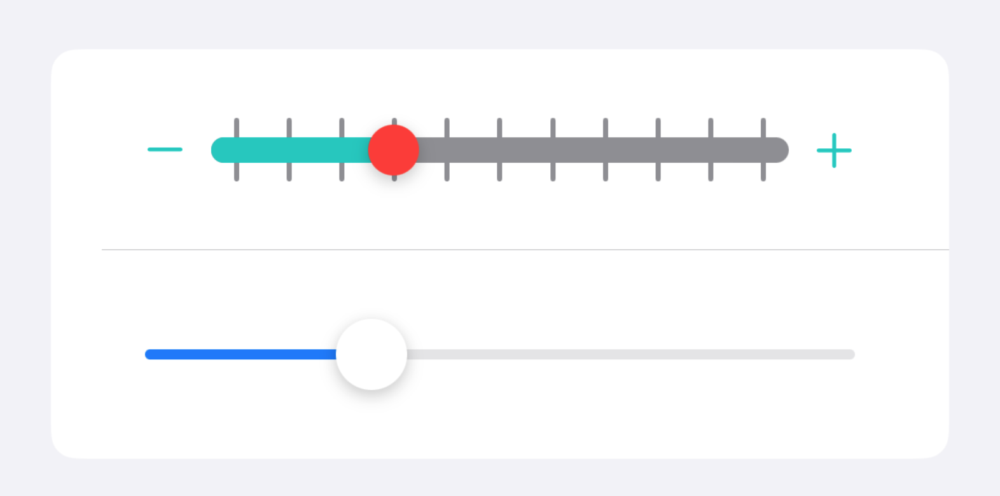
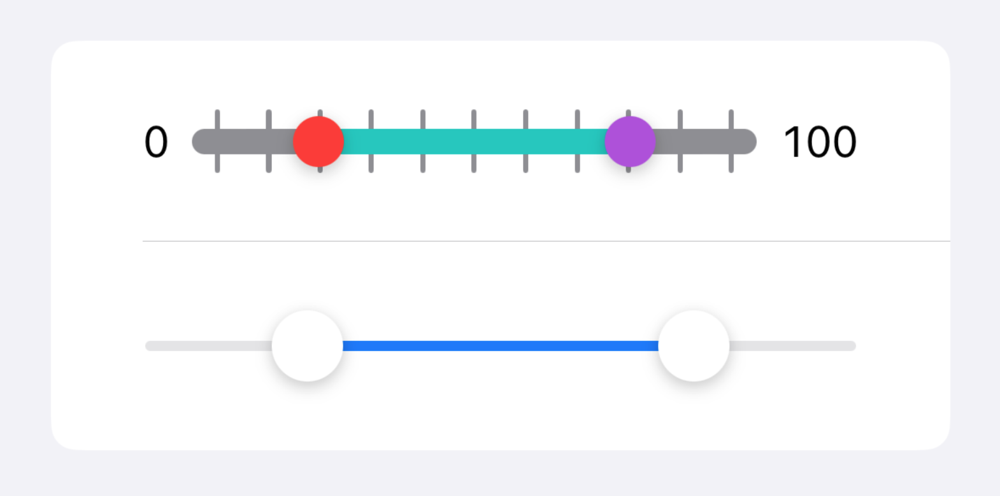

# BetterSlider

[](https://swiftpackageindex.com/lukepistrol/BetterSlider)
[](https://swiftpackageindex.com/lukepistrol/BetterSlider)
[](https://github.com/lukepistrol/BetterSlider/blob/main/LICENSE)

This package provides a custom slider control that allows for more customization than the standard `Slider` control.

## Overview



If you need a slider control that allows for more customization than the standard `Slider` control, 
you can use ``BetterSlider/BetterSlider``.



If you need a slider control to select a range of values, you can use ``BetterSlider/RangeSlider``.

## Documentation

The documentation is available [here](https://lukepistrol.github.io/BetterSlider/documentation/betterslider).

You can also have a look at the [sample project](https://github.com/lukepistrol/BetterSlider/tree/main/BetterSliderDemo/BetterSliderDemo).

## Usage

```swift
dependencies: [
    .package(url: "https://github.com/lukepistrol/BetterSlider.git", from: <#Version#>)
]
```

## Contribution

If you have any ideas on how to take this further I'm happy to discuss things in an issue.

-----

<a href="https://www.buymeacoffee.com/lukeeep" target="_blank"></a>
